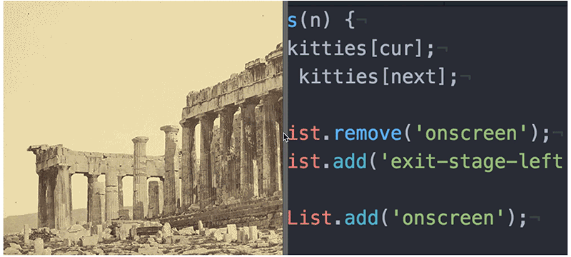

# Resizable Panes

Lots of sites seem to have resizable panes these days. They're often used to show before and after photos with both images staying the same size as the user drags the bar to reveal more of one photo and less of the other. Lots of UIs also feature resizable panes in which the content reflows as the pane it is in grows or shrinks. Let's attempt the first variety, the one with images that do not resize. You can use any two images you want.

You'll want to detect mousedown events on the bar that sits on top of the images. After a mousedown (but before a mouseup), the bar should follow the mouse pointer on the x axis but never move out of the area defined by the left edge and right edge of the images. As the bar moves, the visible portions of the images should change correspondingly.
