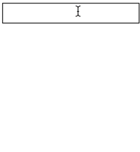

# Incremental Search

Incremental search has become standard on sites across the web.



Let's make an incremental search field that allows users to find one of the countries that exist on earth. A <a href="countries.json"> list of countries</a> has been prepared for you.

* Every time the user types a visible character, if the current value of the input field is at the beginning of the names of any countries in the list, those country names should be displayed (limit it to four countries displayed at a time).

* If the current value of the input is not at the beginning of any of the country names, the string "No results" should be displayed in gray

* If a list of results is displayed and the user clicks outside of it and outside of the input field, the result list should disappear.

* Result lists should reappear when the user gives the input field focus

* If the user mouses over a result in the result list, that result should light up (give it a background color and different text color)

* If a result list is displayed and the user hits an up or down arrow key, the appropriate result should light up

* If the user clicks a result or hits the enter key while a result is lit up, the full country name of the appropriate result should appear in the input field and the result list should disappear!

*Do not use the HTML `<select>` or `<datalist>` tags to solve this challenge!*


# Incremental Search - Part 2

Now that we know how to make ajax requests, let's modify our [Incremental Search](README.md) to fetch results using ajax.

The url to use is `https://flame-egg.glitch.me/` and it requires a query string parameter named `q`. The value of the `q` parameter should be the value that the user has entered into the text field. For example, if the user types the letter 'a', the url should be `https://flame-egg.glitch.me/?q=a`. You should use the `data` field in the object you pass to `$.ajax` to build the query string.

```js
$.ajax({
    url: 'https://flame-egg.glitch.me/',
    data: {
        q: 'a'
    },
    success: function(data) {
        // do something with the data here
    }
});
```

This endpoint uses the exact same list of countries you used in your first version. You can delete that array as well as the code that finds matches in it. Where you used to search for matches you should now make an ajax request. You will have to wait for the response to be received before you can show results. The data passed to your success handler will be an array. For example, if the query string is `q=a`, the data would look like this:

```json
[ "Afghanistan", "Albania", "Algeria", "American Samoa" ]
```

An important thing to keep in mind is that you have no guarantee that you will receive responses to requests in the order in which you make the requests. For example, imagine the user types `a` and then `l` and then `b` in quick succession. Now imagine that the first request takes 50 milliseconds while the second request takes 150 milliseconds and the third request takes 50 milliseconds.

```
a -----50ms-----> Afghanistan
                  Albania
                  Algeria
                  American Samoa

     al ---------------150ms---------------> Albania
                                             Algeria

          alb -----50ms-----> Albania
```

Unless you take steps to prevent it, the end result of this will be a text field that says "alb" and a list of results that includes not only Albania but also Algeria.

One way to avoid this situation would be to abort any pending request you have whenever you are ready to make a new request. To do this, you would have to keep around a reference to the [`jqXHR`](http://api.jquery.com/jQuery.ajax/#jqXHR) object returned by `$.ajax` so you can call `abort` on it when/if the time comes.

Note that calling `abort` will cause any error handler you have specified for the request to run. You can detect this by checking out the second argument passed to your error handler. It will be the string `'abort'`.

### Bonus: Throttling

Something else that can be problematic is the large number of requests this UI can generate. People can type pretty fast so for each user there can be multiple requests per second. This can create too much load for the server to handle. Note that aborting requests doesn't really help with this. If the request has gone out, the server will handle it even if the client stops listening for the response.

To mitigate this, you can _throttle_ requests. That is, you can limit how many requests a user can make. For example, let's say you wanted to make sure that there is at least a quarter of a second between each request. To do this, you could pass to `setTimeout` a function that makes the request as the first argument and `250` as the second argument. If the user changes the input before the scheduled function runs, you could use `clearTimeout` to cancel it and then set another timer for the new request. This would make the UI less responsive for the user, but it would also eliminate a lot of pointless requests.