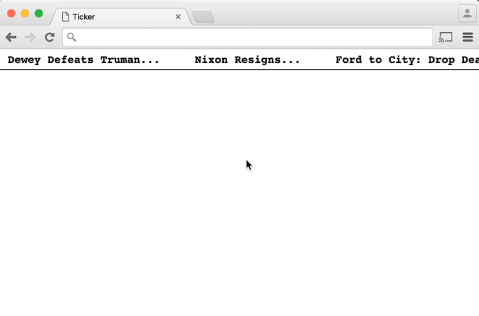

Tickers are a thing people used to put on their websites but don't seem to anymore. That's probably because they are annoying. However, they do provide a good opportunity to look at how <a href="https://developer.mozilla.org/en-US/docs/Web/API/window/requestAnimationFrame">requestAnimationFrame</a> works.

* When the page loads the ticker area should be empty and headlines should start crawling in from the right
* The animation should continue forever. When a headline moves all the way off the screen it should jump to the end.
* Use six to ten headlines/links from your favorite news site

### Part 2

When a users mouses onto a headline, the animation should pause (which will require <a href="https://developer.mozilla.org/en-US/docs/Web/API/Window/cancelAnimationFrame">cancelAnimationFrame</a>) and the headline should turn blue and gain an underline to indicate that it can be clicked. If the user mouses out without clicking, the animation should resume.

### Bonus Challenge

Create an additional ticker that appears at the bottom of the page and has the headlines scrolling in from left to right rather than right to left.