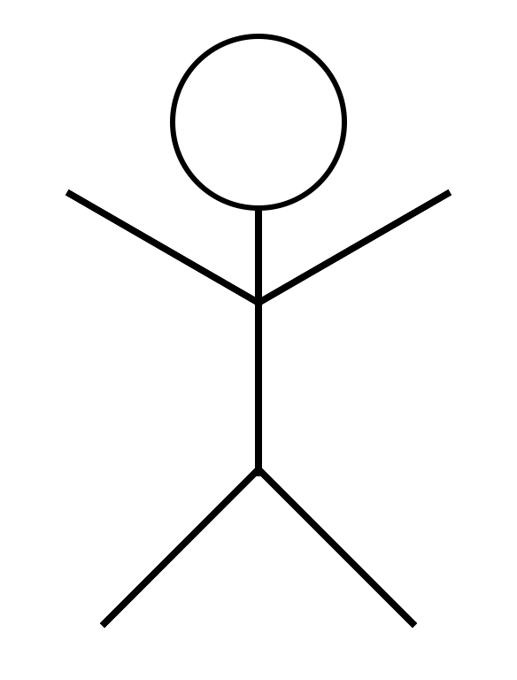

Let's create a stick figure using nothing but HTML and CSS.

You can get the arms and legs to appear correctly by using <a href="https://developer.mozilla.org/en-US/docs/Web/CSS/CSS_Transforms/Using_CSS_transforms">CSS transforms</a> to rotate them.

